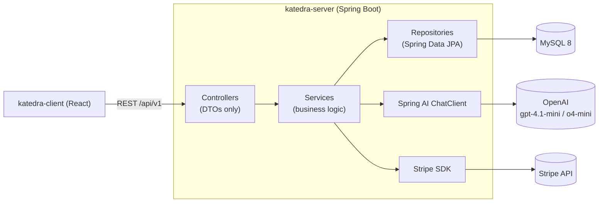

# Katedra Server

[](https://github.com/SAULALEE/katedra-server/actions/workflows/ci.yml)
[](LICENSE)

Backend for **Katedra**, an AI-driven academic content generator for teachers. Give it a
syllabus — typed, uploaded, or from a URL — and it generates the outline, theory, an exam,
and slides, using real OpenAI calls through Spring AI. Spring Boot 4, Java 21, MySQL 8,
Stripe billing.

Spanish version: [README.md](README.md) · Frontend: [katedra-client](https://github.com/SAULALEE/katedra-client)

---

## Live demo

- **App:** https://katedra-client.vercel.app
- **API:** https://katedra-server.onrender.com/api/v1

> **Demo credentials:** not published yet — see [Demo accounts](#demo-accounts) below.
> The API is hosted on Render's free tier, so the first request after a period of
> inactivity can take up to a minute to wake it up.

### Demo accounts

Any email ending in `@katedra.com` self-registers as an admin (`AuthService.resolveRoleByEmail`);
any other email registers as a regular teacher account on the Free plan. Register your own
account at `/auth/register` to try the app immediately — a public seeded demo account with a
Free and a Pro login is planned but not live yet.

---

## Architecture



A layered modular monolith: controllers only see DTOs, entities never leave the service
layer, all AI and Stripe calls are async. Details in
[docs/2_ARCHITECTURE_AND_TECH_STACK.en.md](docs/2_ARCHITECTURE_AND_TECH_STACK.en.md).

---

## Tech stack

| | |
|---|---|
| Language / framework | Java 21, Spring Boot 4.0.6 |
| AI | Spring AI `ChatClient` → OpenAI (`gpt-4.1-mini` / `o4-mini`) |
| Database | MySQL 8.0, Flyway migrations |
| Auth | Stateless JWT, optional Google/Microsoft OAuth2 |
| Billing | Stripe Subscriptions |
| Tests | JUnit 5, Mockito, AssertJ, `@WebMvcTest` — 336 tests |
| API docs | springdoc (live from the code) + a Bruno collection |
| Container | Multi-stage Dockerfile, non-root user |

Full picture: [docs/1_PROJECT_OVERVIEW.en.md](docs/1_PROJECT_OVERVIEW.en.md) ·
[docs/3_STATUS_AND_ROADMAP.en.md](docs/3_STATUS_AND_ROADMAP.en.md).

---

## Quickstart (no Doppler account needed)

Requires Docker.

```bash
git clone https://github.com/SAULALEE/katedra-server.git
cd katedra-server
cp .env.example .env
# edit .env and set OPENAI_API_KEY to generate real content — everything else has a working default
docker compose up -d
```

The API is now at `http://localhost:8080/api/v1`. Confirm it's up:

```bash
curl http://localhost:8080/api/v1/auth/register -X POST -H "Content-Type: application/json" \
  -d '{"email":"you@example.com","password":"Test1234!","nombre":"Your Name"}'
```

Stripe is optional for everything except `GET /suscripciones/planes` (the public pricing
list) — that endpoint calls Stripe unconditionally and needs `STRIPE_PRICE_PRO_MENSUAL` /
`STRIPE_PRICE_PRO_ANUAL` set to respond. Everything else works with billing left blank.

### Running without Docker

Java 21 and a local MySQL 8 are enough — every property in `application.properties` has a
local-development default, so the app starts against `localhost:3306/katedra_dev` with no
configuration at all:

```bash
./mvnw spring-boot:run
```

Contributors with access to the project's Doppler org can skip `.env` entirely:

```bash
doppler run -- ./mvnw spring-boot:run
```

---

## Tests

```bash
./mvnw test
```

336 tests — JUnit 5, Mockito, AssertJ, `@WebMvcTest` slices — run against an in-memory H2
database with Flyway disabled, so no external service is required. CI runs this on every
push to `main` and `staging`.

---

## API documentation

Two sources, always in sync with each other because both come from the same running code:

- **Swagger UI** — start the app, open `http://localhost:8080/api/v1/swagger-ui/index.html`.
  Generated live from the controllers (springdoc), so it cannot drift from the code the way a
  hand-written spec can. Raw spec at `/api/v1/v3/api-docs`.
- **[Bruno collection](api/bruno/)** — 37 requests, one per endpoint, with a `Local` and a
  `Production` environment and a suggested run order. Free, offline, plain-text — open
  `api/bruno/` as a collection in [Bruno](https://www.usebruno.com/).

---

## Project structure

```
src/main/java/Katedra/Server/
  controller/   REST endpoints — DTOs in, DTOs out
  service/      business logic, AI orchestration, Stripe orchestration
  repository/   Spring Data JPA interfaces
  model/        JPA entities and domain enums
  dto/          request/response records
  config/       security, CORS, OpenAPI, OAuth2, Stripe wiring
src/main/resources/
  db/migration/ Flyway scripts
  prompts/      AI system prompts (content, not code — never inlined in .java)
api/bruno/      the Bruno API collection
docs/           architecture and roadmap docs
```

---

## Roadmap

See [docs/3_STATUS_AND_ROADMAP.en.md](docs/3_STATUS_AND_ROADMAP.en.md) for what's shipped and
what's next — briefly: Stripe live mode, demo-account rate limiting, integration tests
against a real database, and deeper slide generation.
