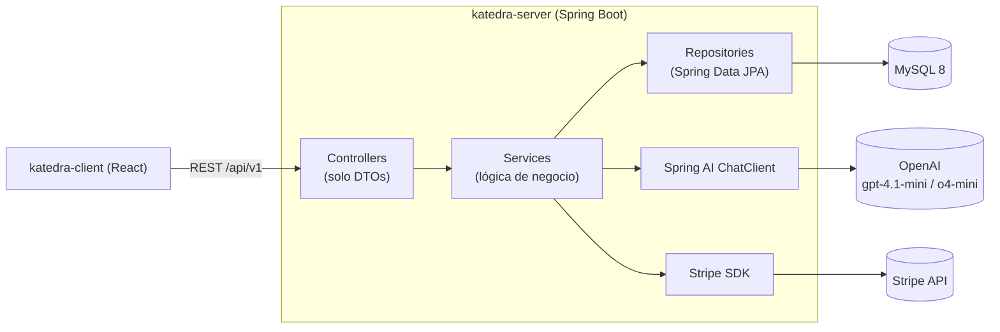

# Katedra Server

[](https://github.com/SAULALEE/katedra-server/actions/workflows/ci.yml)
[](LICENSE)

Backend de **Katedra**, un generador de contenido académico impulsado por IA para
profesores. Se le da un temario —escrito a mano, subido en archivo o desde una URL— y genera
la estructura, la teoría, un examen y diapositivas, usando llamadas reales a OpenAI a través
de Spring AI. Spring Boot 4, Java 21, MySQL 8, facturación con Stripe.

Versión en inglés: [README.en.md](README.en.md) · Frontend: [katedra-client](https://github.com/SAULALEE/katedra-client)

---

## Demo en vivo

- **App:** https://katedra-client.vercel.app
- **API:** https://katedra-server.onrender.com/api/v1

> **Credenciales de demo:** aún no publicadas — ver [Cuentas de demo](#cuentas-de-demo) más abajo.
> El API está alojado en el plan gratuito de Render, así que la primera petición tras un
> período de inactividad puede tardar hasta un minuto en despertar el servicio.

### Cuentas de demo

Cualquier correo que termine en `@katedra.com` se autoregistra como administrador
(`AuthService.resolveRoleByEmail`); cualquier otro correo se registra como cuenta de profesor
normal en el plan Gratis. Regístrate en `/auth/register` para probar la app de inmediato —
una cuenta de demo pública con un login Free y otro Pro está planeada pero aún no publicada.

---

## Arquitectura



Un monolito modular por capas: los controladores solo ven DTOs, las entidades nunca salen de
la capa de servicio, todas las llamadas a IA y Stripe son asíncronas. Detalles en
[docs/2_ARCHITECTURE_AND_TECH_STACK.md](docs/2_ARCHITECTURE_AND_TECH_STACK.md).

---

## Stack tecnológico

| | |
|---|---|
| Lenguaje / framework | Java 21, Spring Boot 4.0.6 |
| IA | Spring AI `ChatClient` → OpenAI (`gpt-4.1-mini` / `o4-mini`) |
| Base de datos | MySQL 8.0 local / PostgreSQL de Supabase, migraciones Flyway |
| Autenticación | JWT sin estado, OAuth2 opcional (Google/Microsoft) |
| Facturación | Stripe Subscriptions |
| Tests | JUnit 5, Mockito, AssertJ, `@WebMvcTest` — 336 tests |
| Documentación de API | springdoc (generado en vivo desde el código) + colección Bruno |
| Contenedor | Dockerfile multi-etapa, usuario no-root |

Panorama completo: [docs/1_PROJECT_OVERVIEW.md](docs/1_PROJECT_OVERVIEW.md) ·
[docs/3_STATUS_AND_ROADMAP.md](docs/3_STATUS_AND_ROADMAP.md).

---

## Inicio rápido

Requiere Docker, Doppler y acceso al proyecto `katedra-server`.

```bash
git clone https://github.com/SAULALEE/katedra-server.git
cd katedra-server
doppler login
./scripts/local-stack.sh up
```

El API queda disponible en `http://localhost:8080/api/v1`. Confírmalo:

```bash
curl http://localhost:8080/api/v1/auth/register -X POST -H "Content-Type: application/json" \
  -d '{"email":"tu@ejemplo.com","password":"Test1234!","nombre":"Tu Nombre"}'
```

Stripe es opcional para todo excepto `GET /suscripciones/planes` (el listado público de
precios) — ese endpoint llama a Stripe incondicionalmente y necesita
`STRIPE_PRICE_PRO_MENSUAL` / `STRIPE_PRICE_PRO_ANUAL` configurados para responder. Todo lo
demás funciona con la facturación en blanco.

### Modos de ejecución

`local` usa backend local y MySQL local en Docker. `production` usa el perfil Supabase; el
backend alojado se utiliza desde el cliente con `npm run dev:production`.

Para ejecutar el backend local conectado a Supabase:

```bash
./scripts/run-production.sh
```

Las configuraciones Doppler requeridas son `local` y `production`. `local` debe contener
`SPRING_PROFILES_ACTIVE=mysql`, credenciales MySQL y las variables del API local. `production`
debe contener `SPRING_PROFILES_ACTIVE=supabase`, `SUPABASE_DB_*` y las credenciales de
producción. Flyway usa `src/main/resources/db/migration-postgresql/B25__baseline_katedra_postgresql.sql`
en el perfil Supabase.

### Ejecutar sin Docker

Para iniciar únicamente el backend local contra un MySQL ya disponible:

```bash
./scripts/run-local.sh
```

Estos scripts siempre ejecutan Maven o Docker a través de Doppler. No se usan `.env`,
`.env.local` ni valores locales alternativos.

---

## Tests

```bash
./scripts/test.sh
```

343 tests —JUnit 5, Mockito, AssertJ, slices `@WebMvcTest`— corren contra una base de datos
H2 en memoria con Flyway deshabilitado, sin necesitar ningún servicio externo. CI ejecuta esto
en cada push a `main` y `staging`.

---

## Documentación de la API

Dos fuentes, siempre sincronizadas entre sí porque ambas provienen del mismo código en ejecución:

- **Swagger UI** — arranca la app y abre `http://localhost:8080/api/v1/swagger-ui/index.html`.
  Generado en vivo desde los controladores (springdoc), por lo que no puede desincronizarse
  del código como sí le pasaba a una especificación escrita a mano. Spec cruda en
  `/api/v1/v3/api-docs`.
- **[Colección de Bruno](api/bruno/)** — 37 peticiones, una por endpoint, con un entorno
  `Local` y otro `Production` y un orden de ejecución sugerido. Gratis, offline, en texto
  plano — abre `api/bruno/` como colección en [Bruno](https://www.usebruno.com/).

---

## Estructura del proyecto

```
src/main/java/Katedra/Server/
  controller/   endpoints REST — solo DTOs de entrada y salida
  service/      lógica de negocio, orquestación de IA, orquestación de Stripe
  repository/   interfaces de Spring Data JPA
  model/        entidades JPA y enums de dominio
  dto/          records de request/response
  config/       seguridad, CORS, OpenAPI, OAuth2, configuración de Stripe
src/main/resources/
  db/migration/ scripts de Flyway
  prompts/      prompts de IA (contenido, no código — nunca en línea en un .java)
api/bruno/      la colección de API de Bruno
docs/           documentación de arquitectura y roadmap
```

---

## Roadmap

Ver [docs/3_STATUS_AND_ROADMAP.md](docs/3_STATUS_AND_ROADMAP.md) para lo que ya está
publicado y lo que sigue —brevemente: modo live de Stripe, límite de uso para la cuenta de
demo, tests de integración contra una base de datos real, y generación de diapositivas más
profunda.
